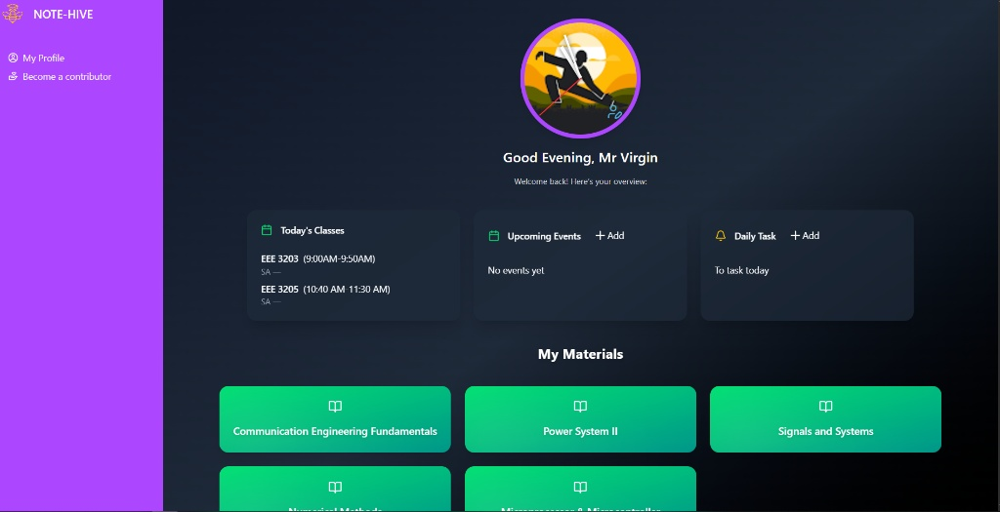

# 📘 Note Hive  

**Note Hive** is a modern platform created for engineering students to easily **find, share, and manage academic notes** based on **subject** and **semester**.  
It features **role-based access** (User, Contributor, Admin) and integrates **AI-powered assistance with Gemini** to help students study smarter.  

---

## ✨ Features  

- 🔑 **Authentication & Security**
  - Firebase authentication for secure login  
  - JWT-based session handling  

- 📚 **Notes by Subject & Semester**
  - Organized academic resources for engineering students  

- 👥 **Role-Based Access**
  - **User** → Browse & download notes  
  - **Contributor** → Upload and manage PDF notes  
  - **Admin** → Manage users, approve content, and oversee the platform  

- 🤖 **AI Assistant (Gemini)**
  - AI-powered **note summarization**  
  - **Question answering** based on uploaded notes  
  - Helps students quickly grasp important concepts  

- 🎨 **Modern UI**
  - Built with **React.js**, **TailwindCSS**, and **shadcn/ui**  

- ⚡ **Robust Backend**
  - Powered by **Node.js**, **Express.js**, and **MongoDB**  

---

## 🖼️ Screenshots  

### 🔹 User Dashboard  
Users can browse notes by semester & subject.  
  

### 🔹 Contributor Panel  
Contributors can upload and manage PDF notes.  
  

### 🔹 Admin Dashboard  
Admins manage users, approve content, and oversee the platform.  
  

### 🔹 Gemini AI Assistant  
Students can summarize notes, ask questions, and get instant AI-powered help.  
  

---

## 🛠️ Tech Stack  

**Frontend:**  
- React.js  
- TailwindCSS  
- shadcn/ui  

**Backend:**  
- Node.js  
- Express.js  
- MongoDB  

**Authentication & Security:**  
- Firebase Authentication  
- JSON Web Tokens (JWT)  

**AI Integration:**  
- Gemini API (for summarization & Q&A)  

---

## 🚀 Getting Started  

### 1️⃣ Clone the repository  
```bash
git clone https://github.com/your-username/note-hive.git
cd note-hive

